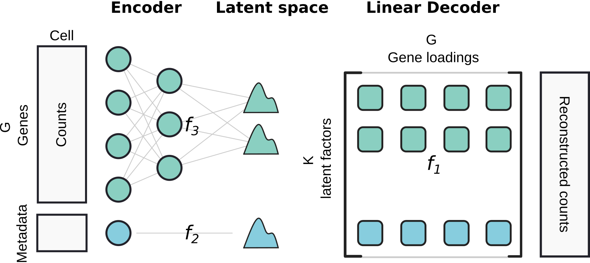

# scCoral

[![Tests][badge-tests]][link-tests]
[![Documentation][badge-docs]][link-docs]
![codecov][badge-codecov]

[badge-tests]: https://img.shields.io/github/actions/workflow/status/lucas-diedrich/scCoral/test.yaml?branch=main
[link-tests]: https://github.com/lucas-diedrich/sccoral/actions/workflows/test.yaml/badge.svg
[badge-docs]: https://readthedocs.org/projects/sccoral/badge/?version=latest&style=default
[badge-codecov]: https://codecov.io/gh/lucas-diedrich/sccoral/graph/badge.svg?token=IXBPQ5SSXL

### Motivation

Increasing throughput in single-cell technologies enables researchers to create population-scale single-cell RNAseq datasets. An ongoing challenge in the analysis of this data is to link molecular features (i.e. single-cell gene expression) with patient-level covariates (e.g. disease severity, age, sex, ...). `sccoral` aims to find an interpretable link between subject/sample-level features and gene expression by embedding cellular metadata and gene expression in the same latent space of a variational autoencoder architecture `lopez2018`. By leveraging and improving the network architecture of linear scVI `svensson2020`, we aim to find a direct and interpretable link between embedded covariates and gene expression.

<!-- Please refer to the [documentation][link-docs]. In particular, the

-   [API documentation][link-api]. -->




 


### Installation

This repository is still under active development. If you want to install the package, please install it directly from `GitHub`.

<!--
You need to have Python 3.9 or newer installed on your system. If you don't have
Python installed, we recommend installing [Mambaforge](https://github.com/conda-forge/miniforge#mambaforge). -->

<!--
1) Install the latest release of `scCoral` from `PyPI <https://pypi.org/project/scCoral/>`_:

```bash
pip install scCoral
```
-->

Create a suitable conda environment with Python 3.10 or newer:

```{bash}
conda create -n scvi-env python=3.11
conda activate scvi-env
```

Install the latest development version:

```bash
pip install git+https://github.com/lucas-diedrich/sccoral.git@main
```

### Usage

See also the [tutorials](https://sccoral.readthedocs.io/en/latest/tutorials/index.html). 

```{python}
import sccoral

# Load data
adata = sccoral.data.splatter_simulation()

# Setup + train model with scvi-tools syntax
sccoral.model.setup_anndata(adata,
                            categorical_covariates='categorical_covariate',
                            continuous_covariates='continuous_covariates'
                            )
model = sccoral.model.SCCORAL(adata, n_latent=7)
model.train()

# Get latent representation of cells/factor usages
z = model.get_latent_representation()

# Get interpretable gene programs (factor loadings)
loadings = model.get_loadings()
```

## Release notes

This repository is still under active development. See the [changelog][changelog].

## Contact

For feedback, questions and help requests, you can reach out via the issue tracker. Feel free to contact us via [ldiedric@broadinstitute.org](mailto:ldiedric@broadinstitute.org)

<!-- in the [scverse discourse][scverse-discourse]. -->

If you found a bug, please also use the [issue tracker][issue-tracker].


## Citation

> None

[scverse-discourse]: https://discourse.scverse.org/
[issue-tracker]: https://github.com/lucas-diedrich/scCoral/issues
[changelog]: https://sccoral.readthedocs.io/en/latest/changelog.html
[link-docs]: https://sccoral.readthedocs.io
[link-api]: https://sccoral.readthedocs.io/en/latest/api.html
